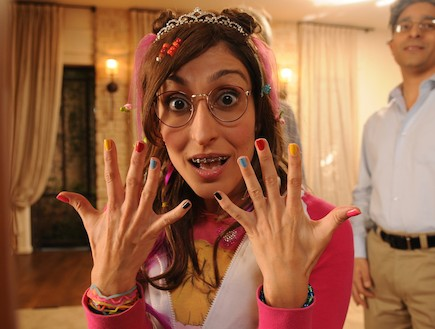

<!doctype html>
<html>
  <head>
    <title>Bat Mizvush</title>
    <meta charset="utf-8">
    <meta property="viewport" content="width=device-width,initial-scale=1">
    <link rel="icon" href="12.png">
  </head>

<body dir="rtl">
<body bgcolor="#C71585">

 
<B>BatMitvush Kululush</b>

 
 
 
 
 
 
 

 
 
 
 
 
 
 
 
 
 
 
 

 

היושששששששששש אתמול חגגתי בתמצווש 
<b>מ-ט-ו-ר-פ-ת</b>
 
<big>אמרתי לעצמי למה לא לשתף את העולמוש בבתמצווש המדהימוש שאבוש ואמוש עשו לי?</big>

 

  </body>
</html>					        
		
